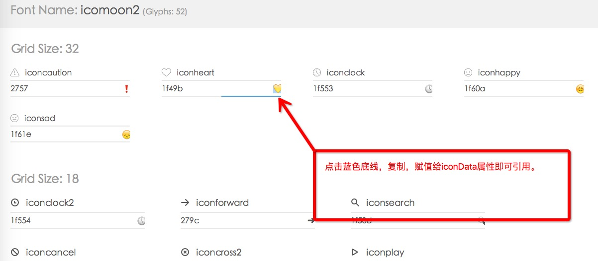

#LDialog Plugin

###LDialog Plugin 介绍

此插件基于jquery开发，能够适用于一般的弹出对话框，弹出框，确认框等。支持主流浏览器。

###How to use
*   在头部引入蒙版css文件,**同时将fonts字体图标文件放置在css同级目录中。** 
	
```
	<link rel="stylesheet" href="../css/ldialog.css"/>
```

*  引入jquery以及ldialog.js文件（注意次序）：

```
	<script src="../js/jquery.min.js"></script>
	<script src="../js/ldialog.js"></script>
```

当在监听事件中需要弹出对话框或蒙版时，开始实例化一个蒙版，并初始化（可同时创建任意数量的蒙版),例如这样：

```
    var dialog = new LDialog("test2", {footer: false}, {btn: {sure: "btn-info"}});
    dialog.init();
```

### LDialog参数说明

 new LDialog（arg1, arg2, arg3）可以传入（选填）三个参数：

#### arg1 (字符串)

| 参数名        | 数据类型           | 默认值  |   描述  | 备注 | 
|:---------------|:---------------|:-------|:---------:|:------:|
| arg1     | String | null | 重写蒙版显示内容| 可以是纯文本，也可以是html代码|


#### arg2 (对象)

| 参数名        | 数据类型           | 默认值  |   描述  | 备注 |
|:---------------|:---------------|:-------|:---------:|:----:|
| sureTitle     | String | “确定” | 重写蒙版底部确定按钮显示文字||
| subtitle | String | null | 定义副标题内容 ||
| cancelTitle | String | "取消" | 重写蒙版底部取消按钮显示文字||
| globalClose | boolean | false | 定义蒙版是否全局关闭 | 点击蒙版以外区域关闭蒙版|
| title | String | null | 定义蒙版标题 | 若arg3参数也定义此参数，以arg2参数定义为准|
| footer | boolean | true | 定义蒙版底部按钮组框架是否显示 ||
| header | boolean | true | 定义蒙版标题模块是否显示 ||
| icon | boolean | true | 定义蒙版内容块图标是否显示 ||
| iconSize | String | null | 定义内容块左边图标大小 | |
| iconColor | String | null | 定义内容块左边图标大小 | |
| iconData | String | null | 定义图标源|  若arg3参数也定义此参数，以arg2参数定义为准|
| timeOut | Number | -1 | 定义蒙版显示多长时间后消失 | 默认使用-1代表不消失 |
| opacity | Number | 0.5 | 定义蒙版透明度 | |
| outline | boolean | false | 定义是否显示outline效果 | 类似facebook蒙版效果,常用于操作成功的提示信息 |
| radius | Strig | "5px" | 定义蒙版的圆角 | |
| enterAni | String | "fadeInDown" | 定义进入动画 | 可自定义引入animate.css动画库的动画class，本插件预加载slide与fade动画效果 |
| minHeight | String | "50px" | 定义蒙版最低高度| |
| width | String | "550px" | 定义蒙版宽度 | |
| verCenter | boolean | false | 定义蒙版是否居中显示 | 默认不居中，距顶部40px |
| onSure(data) | function | null | 点击确定按钮的回调函数,可选data参数，获得所有蒙版input输入框的中的值，以数组形式展现| |
| onCancel |function | null | 点击取消按钮的回调函数| |
| onClose | function | null | 点击关闭按钮的回调函数 | |

说明：

内容左边引用的是字体图标，属性是iconData，插件默认引用了52个常用的字体图标，下面有预览入口，用法如图：



#### arg3(对象、字符串)

已经预定义了几组类型的蒙版显示效果，分别是：

**info、 success 、error 、 confirm 、 input 、 custom**

当使用时，直接赋值给arg3参数相应的字符串即可。

具体形式如下：

```
    var popType = {
        info: {
            title: "信息",
            btn: {
                sure: "btn-info",
                cancel: "btn-default"
            },
            iconData: ""
        },
        success: {
            title: "成功",
            btn: {
                sure: "btn-success",
                cancel: "btn-default"
            },
            iconData: ""
        },
        error: {
            title: "错误",
            btn: {
                sure: "btn-error",
                cancel: "btn-default"
            },
            iconData: ""
        },
        confirm: {
            title: "提示",
            btn: {
                sure: "btn-warning",
                cancel: "btn-default"
            },
            iconData: ""
        },
        input: {
            title: "输入",
            btn: {
                sure: "btn-primary",
                cancel: "btn-default"
            }
        },
        custom: {
            title: "弹窗",
            btn: {}
        }
    };
```

按钮组预定了6组：

**btn-default 、 btn-primary 、 btn-error 、 btn-success 、 btn-info、 btn-warning**

样式可在底部demo页面中查看。

可以自定义按钮class，形式如下：

```
.btn-自定义 {
    color: #333;
    background-color: #fff;
    border-color: #ccc;
}
.btn-自定义:hover {
    color: #fff;
    background-color: #479C82;
    border-color: #469079;
}
```

若是只需要确定或取消按钮，可以只定义一个按钮即可：

```
btn: {
	sure: "btn-default"
}
```

### Live Demo 

插件demo：[传送门](http://luojinghui.github.io/LDialog/html/index.html)

字体图标： [传送门](http://luojinghui.github.io/LDialog/font-demo/demo.html)

###版本

*   Version 1.0.0 ：完成蒙版基础功能。
*   Version 1.0.1 ：增加蒙版居中、全局关闭、自定义进入动画、outline功能。

